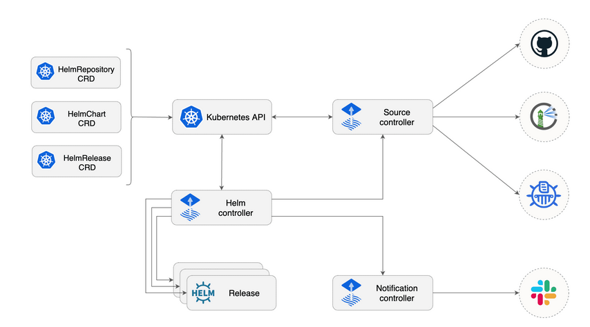

# Flux working schema.


# Flux Helm Operator (in the flux stack, responsible for installing, updating and deleting charts)



По факту просто бинарный файл на go, который детектит обновление в файле helm release и на основании этого устанавливает/обновляет/удаляет на основании изменений каких-либо (helm release это просто описание того, какой чарт и откуда устанавливается/изменяется/удаляется)

# Repository Example

```
.
├── apps
│   ├── base                              # Базовые определения
│   │   ├── app                           # Ваше приложение
│   │   │   ├── deployment.yaml
│   │   │   ├── service.yaml
│   │   │   ├── hpa.yaml
│   │   │   └── kustomization.yaml
│   │   ├── monitoring                    # Мониторинг
│   │   │   ├── prometheus
│   │   │   └── grafana
│   │   └── flux-monitoring              # Мониторинг Flux
│   │
│   └── bundles                          # Бандлы для разных сред
│       ├── gke-dev                      # Разработка
│       │   ├── kustomization.yaml       # Включает base + dev настройки
│       │   └── values.yaml
│       ├── gke-preprod                  # Предпродакшен
│       │   ├── kustomization.yaml
│       │   └── values.yaml
│       └── gke-prod                     # Продакшен
│           ├── stable                   # Стабильная версия
│           │   ├── kustomization.yaml
│           │   └── values.yaml
│           └── canary                   # Канареечная версия
│               ├── kustomization.yaml
│               └── values.yaml
│
└── clusters
    ├── gke-dev                          # Dev кластер
    │   ├── flux-system
    │   │   └── gotk-components.yaml
    │   └── apps
    │       └── kustomization.yaml       # Подключает gke-dev bundle
    ├── gke-preprod                      # Preprod кластер
    │   ├── flux-system
    │   └── apps
    │       └── kustomization.yaml       # Подключает gke-preprod bundle
    └── gke-prod                         # Prod кластер
        ├── flux-system
        └── apps
            ├── kustomization.yaml       # Подключает gke-prod/stable
            └── canary
                └── kustomization.yaml   # Подключает gke-prod/canary
````

# Idea

Инфраструктура следует трехуровневой архитектуре для кастомизации приложений:

1. **Базовый уровень** (`apps/base/`)
   - Определяет общие компоненты и конфигурации приложений
   - Содержит общие значения и ресурсы, используемые во всех средах
   - Примеры: базовые развертывания, сервисы, HPA конфиги, настройки мониторинга

2. **Уровень бандлов** (`apps/bundles/`)
   - Агрегирует базовые приложения с кастомизацией под конкретную среду
   - Предоставляет конфигурации для разных сред (dev, preprod, prod)
   - Управляет настройками канареечных развертываний для продакшена

3. **Уровень кластеров** (`clusters/[cluster_name]/`)
   - Точка входа для конфигураций конкретного GCP кластера
   - Позволяет переопределять настройки под конкретный кластер
   - Управляет переменными и секретами для конкретной среды

## Структура директорий

```plaintext
.
├── apps/
│   ├── base/                   # Уровень 1: Базовые определения
│   │   ├── application/        # Базовые конфиги приложения
│   │   │   ├── deployment.yaml
│   │   │   ├── service.yaml
│   │   │   ├── hpa.yaml
│   │   │   └── kustomization.yaml
│   │   └── monitoring/         # Общие конфиги мониторинга
│   │
│   └── bundles/                # Уровень 2: Бандлы сред
│       ├── gcp-dev/           # Среда разработки
│       ├── gcp-preprod/       # Предпродакшн среда
│       └── gcp-prod/          # Продакшн среда
│           ├── stable/        # Стабильные конфиги продакшна
│           └── canary/        # Конфиги канареечного деплоя
│
└── clusters/                   # Уровень 3: Конфигурации кластеров
    ├── dev-cluster/           # Кластер разработки
    ├── preprod-cluster/       # Предпродакшн кластер
    └── prod-cluster/          # Продакшн кластер
        ├── flux-system/       # Конфигурация Flux
        └── apps/             # Точка входа приложений
            ├── stable/       # Стабильный продакшн деплой
            └── canary/       # Канареечный деплой
````


## Детали уровней

### 1. Базовый уровень (`apps/base/`)

- Содержит фундаментальные конфигурации, общие для всех сред
- Определяет базовые Kubernetes ресурсы (Deployments, Services и т.д.)
- Включает общие конфигурации для:
    - Компонентов приложения
    - Настройки мониторинга
    - Запросов ресурсов/лимитов
    - Проверок работоспособности
    - Общих меток и аннотаций

### 2. Уровень бандлов (`apps/bundles/`)

- Агрегирует и кастомизирует базовые конфигурации для конкретных сред
- Бандл разработки (`gcp-dev/`):
    - Мягкие лимиты ресурсов
    - Включенный режим отладки
    - Специфичные для разработки настройки
- Предпродакшн бандл (`gcp-preprod/`):
    - Настройки, близкие к продакшну
    - Конфигурации для тестирования
- Продакшн бандл (`gcp-prod/`):
    - Строгие лимиты ресурсов
    - Настройки канареечного деплоя
    - Конфигурации высокой доступности
    - Политики безопасности продакшна

### 3. Уровень кластеров (`clusters/[cluster_name]/`)

- Конфигурации для конкретных сред
- Интеграция с GCP-специфичными ресурсами
- Настройка и синхронизация Flux
- Кастомизации под конкретный кластер:
    - Привязки GCP IAM
    - Конфигурации Cloud Load Balancer
    - Секреты кластера
    - Переменные окружения

## Стратегия канареечного деплоя

Продакшн среда (`clusters/prod-cluster/`) поддерживает канареечные деплои:

1. Базовое приложение развернуто как стабильная версия
2. Канареечная версия развертывается с:
    - Ограниченными ресурсами
    - Контролем трафика (например, разделение 90/10)
    - Отдельным мониторингом и метриками
3. Путь продвижения:
    - Валидация канарейки
    - Корректировка трафика
    - Полный продакшн роллаут

## Прогрессия сред

```
Разработка → Предпродакшн → Продакшн канарейка → Продакшн стабильный
(gcp-dev)    (gcp-preprod)    (gcp-prod/canary)   (gcp-prod/stable)
```

Example:

https://github.com/brainfair/awesome-flux-infra?tab=readme-ov-file


Resources:

https://www.youtube.com/watch?v=d-H2K4I7-jk

https://www.youtube.com/watch?v=T4fkWIGahiQ&t=1271s

https://fluxcd.io/flux/use-cases/helm/


# Postgres Deployment 


Мы можем использовать cloud native pg для деплоя postgres в google cloud 

Resources:

https://cloud.google.com/kubernetes-engine/docs/tutorials/stateful-workloads/cloudnativepg


Либо альтернативный вариант развертывать как StatefulSet (я думаю более предпочтительный для нас в связи с более гибкой настройкой):


https://cloud.google.com/kubernetes-engine/docs/tutorials/stateful-workloads/postgresql
https://habr.com/ru/companies/first/articles/662784/


Как пример:

```yaml
apiVersion: v1
kind: Service
metadata:
  name: postgres
  labels:
    app: postgres
spec:
  ports:
    - port: 5432
  clusterIP: None
  selector:
    app: postgres
---
apiVersion: apps/v1
kind: StatefulSet
metadata:
  name: postgres
spec:
  selector:
    matchLabels:
      app: postgres
  serviceName: "postgres"
  replicas: 1
  template:
    metadata:
      labels:
        app: postgres
    spec:
      containers:
      - name: postgres
        image: postgres:15
        ports:
        - containerPort: 5432
        env:
        - name: POSTGRES_DB
          value: "mydb"
        - name: POSTGRES_USER
          value: "user"
        - name: POSTGRES_PASSWORD
          value: "password"
        volumeMounts:
        - name: postgres-data
          mountPath: /var/lib/postgresql/data
  volumeClaimTemplates:
  - metadata:
      name: postgres-data
    spec:
      accessModes: ["ReadWriteOnce"]
      resources:
        requests:
          storage: 10Gi
```


